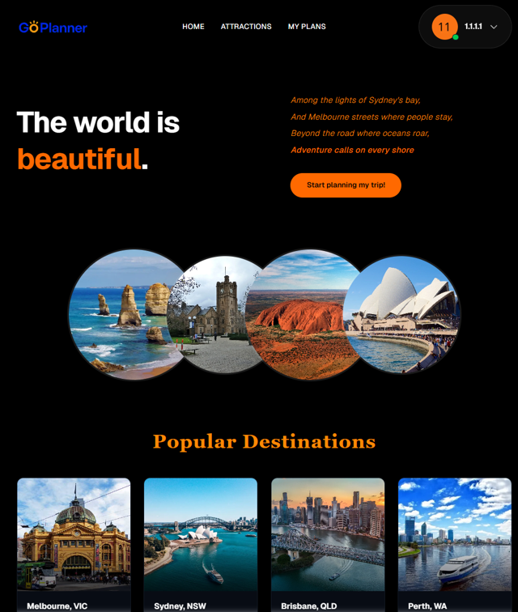
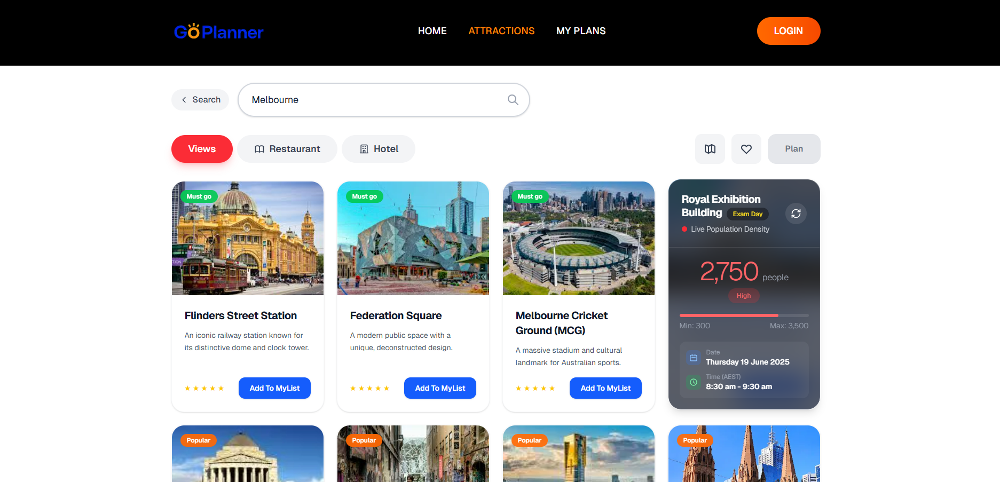
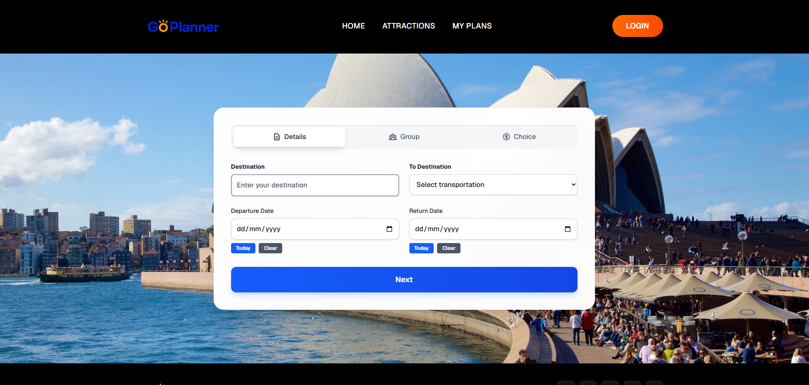
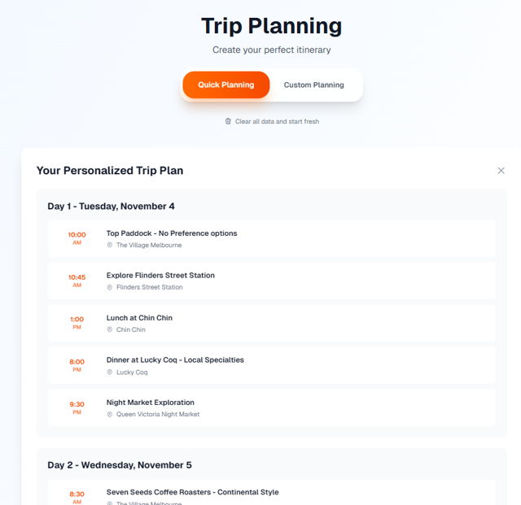
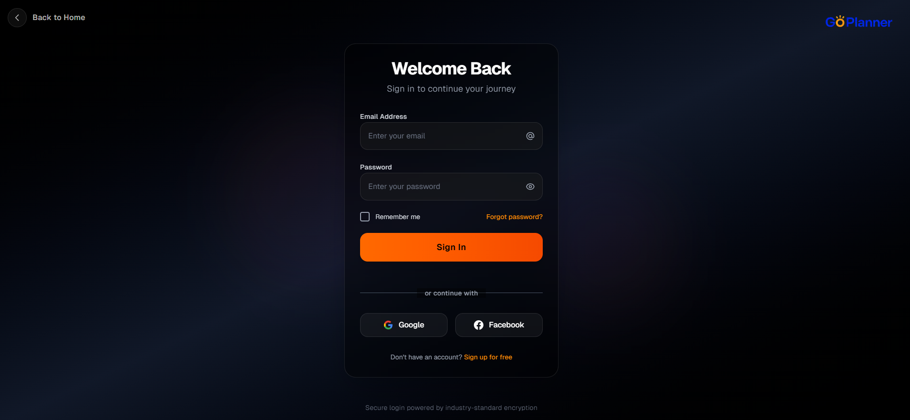
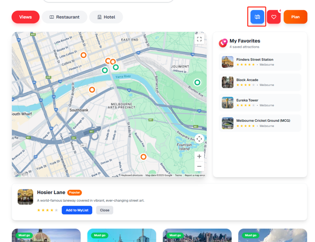

# 🌏 GoPlanner – Travel Recommendation & Trip Planning Web App

GoPlanner is a web-based travel planning platform designed to help users discover attractions, filter points of interest, check real-time population levels, and generate personalised travel itineraries.

This project was developed as part of a university team collaboration. My main responsibilities include front-end feature development, UI optimisation, and API integration.

---

## ✨ Features

### 🔍 Attraction Discovery
- Browse attractions across Melbourne and other regions  
- Filter by tags, distance, rating, and categories  
- View attraction details and media  

### 📍 Smart Recommendation
- Integrates location-based services  
- Predicts low-traffic visiting times using population density data  
- Utilises CAMARA API for device-count & regional traffic estimation  

### ⭐ User Personalisation
- User login / signup  
- Save attractions to favourites  
- View personalised favourites list  

### 🗺️ Trip Planning
- Create custom itineraries  
- Add / reorder / delete trip items  
- View trip summary page  

### 💡 Responsive Front-End
- Built with **Next.js + React + TypeScript**  
- Modern UI and smooth interaction  
- Improved load performance through API optimisation  

---

## 🛠️ Tech Stack

| Category | Technology |
|---------|------------|
| **Frontend** | Next.js, React, TypeScript, CSS Modules |
| **Backend / API** | Node.js API Routes, CAMARA API |
| **Database / Auth** | Firebase Auth / Secure Local Storage |
| **Tools** | Git, GitHub, VSCode |
| **Deployment** | Next.js Dev Server |

---

## 👩‍💻 My Contribution

### Front-End Development
- Built login & register pages with form validation and API integration  
- Developed the **Favourites** system: add/remove attractions, render UI dynamically  
- Implemented attraction filtering UI (tags, ratings, distance)  
- Added multiple responsive pages under `/src/app` using Next.js routing  

### Feature Development
- Integrated CAMARA API to fetch population density & device count  
- Implemented home page search flow and quick recommendation UI  
- Built a full **manual itinerary planning module**  
- Improved performance by reducing duplicated API requests and optimising state updates  

### Team Collaboration
- Managed feature branches and resolved merge conflicts  
- Participated in code reviews and documentation  
- Coordinated frontend workflow and coding conventions  

---

## 📸 Screenshots
### 🏠 Homepage


### 🔍 Search and Filtering


### ⭐ Information


### ⏳ Trip Planner


### 💬 Login


### 🗺️ Map


---

## 🚀 Getting Started

```bash
npm install
npm run dev
